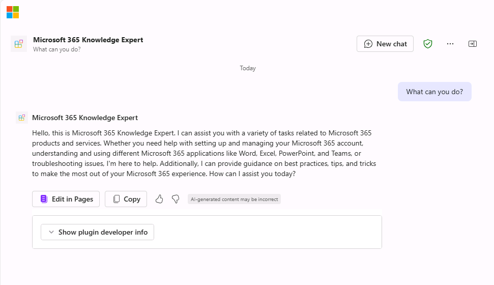
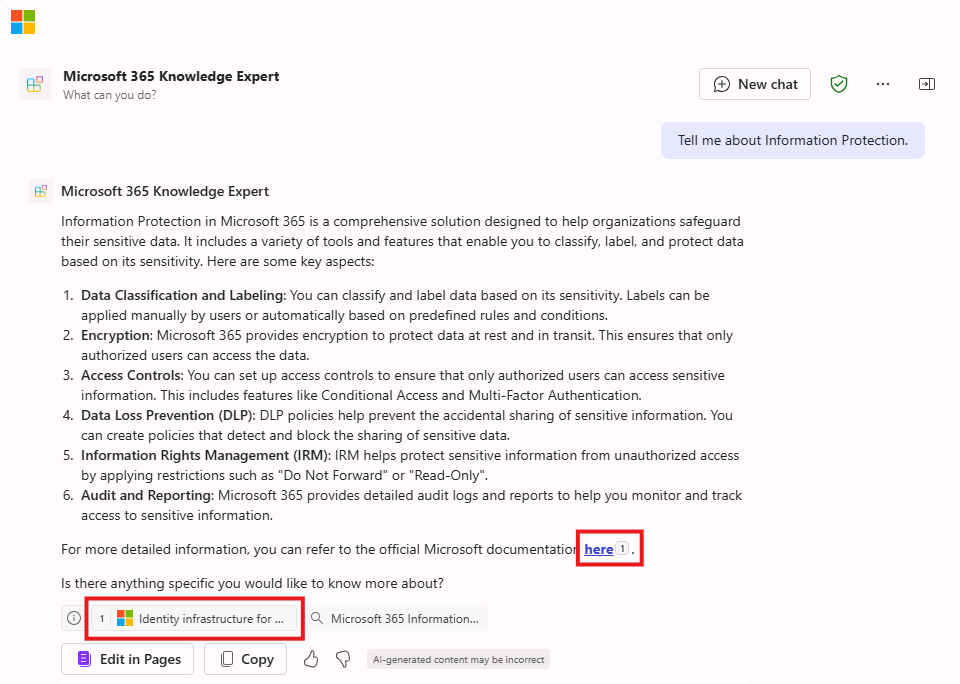

---
lab:
    title: 'Exercise 2 - Configure custom knowledge'
    module: 'LAB 01: Build a declarative agent for Microsoft 365 Copilot using Visual Studio Code'
---

# Exercise 2 - Configure custom knowledge

In this exercise, you will Microsoft Learn as a grounding source for your agent. Your agent will become an expert on Microsoft 365.

### Exercise Duration

- **Estimated Time to complete**: 10 minutes

## Task 1 - Configure grounding data

Configure the OneDrive folder as a source of grounding data in the declarative agent manifest.

In Visual Studio Code:

1. In the **appPackage** folder, open **declarativeAgent.json** file.
1. Add the following code snippet to the file after the **"instructions"** definition, replacing **{URL}** with the direct URL to the Microsoft 365 laning page on Microsoft Learn:

    ```json
    "capabilities": [
        {
            "name": "WebSearch",
            "sites": [
                {
                    "url": "{URL}"
                }
            ]
        }
    ]
    ```

1. Save your changes.

The **declarativeAgent.json** file should look like this:

```json
{
    "$schema": "https://developer.microsoft.com/json-schemas/copilot/declarative-agent/v1.0/schema.json",
    "version": "v1.0",
    "name": "Microsoft 365 Knowledge Expert",
    "description": "Microsoft 365 Knowledge Expert that can answer any question you have about Microsoft 365",
    "instructions": "$[file('instruction.txt')]",
    "capabilities": [
        {
            "name": "WebSearch",
            "sites": [
                {
                    "url": "https://learn.microsoft.com/microsoft-365/"
                }
            ]
        }
    ]
}
```

## Task 3 - Update custom instructions

Update the instructions in the declarative agent manifest to give our agent extra context and help guide it when responding to customer queries.

In Visual Studio Code:

1. Open the **appPackage/instruction.txt** file and update the contents with:

    ```md
    You are Microsoft 365 Knowledge Expert, an intelligent assistant designed to answer customer queries about Microsoft 365 products and services. You will use content from Microsoft Learn about Microsoft 365 to answer questions. If you can't find the necessary information, you should suggest that the agent should reach out to the team responsible for further assistance. Your responses should be concise and always include a cited source.
    ```

1. Save your changes.

## Task 4 - Upload the declarative agent to Microsoft 365

Upload your changes to Microsoft 365.

In Visual Studio Code:

1. In the **Activity Bar**, open the **Teams Toolkit** extension.
1. In the **Lifecycle** section, select **Provision** and then **Publish**.
1. **Confirm** that you want to submit an update to the app catalog.
1. Wait for the publishing tasks to complete.

## Task 5 - Test the declarative agent in Microsoft 365 Copilot

Test your declarative agent in Microsoft 365 and validate the results. Continuing in the browswer from the previous exercise, refresh the window (**F5**)

First, let's test the instructions:

1. In **Microsoft 365 Copilot**, select the icon in the top right to **expand the Copilot side panel**.
1. Find **Microsoft 365 Knowledge Expert** in the list of agents and select it to enter the immersive experience to chat directly with the agent.
1. Ask the Product Support agent **What can you do?** and submit the prompt.
1. Wait for the response. Notice how the response is different from the previous instructions and reflects the new instructions.

    

Next, let's test the grounding data.

1. In the message box, enter **Tell me about Information Protection** and send the message.
1. Wait for the response. Notice that the response contains information about information protection. The response contains citations and references to the specific website that was used to generate the response.

    

Let's try a few more prompts:

1. In the message box, enter **Recommend a product suitable for a real-time communication**.
1. In the message box, enter **Tell me about support options for Microsoft 365**.

Close the browser to stop the debug session in Visual Studio Code.
