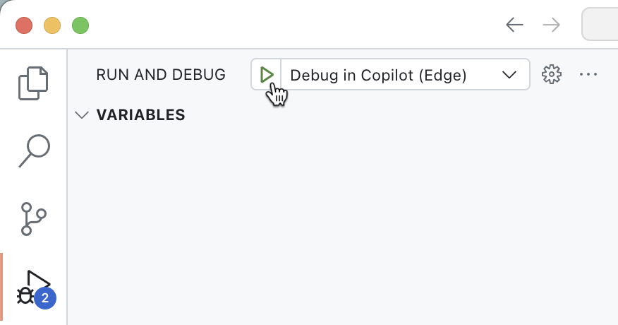
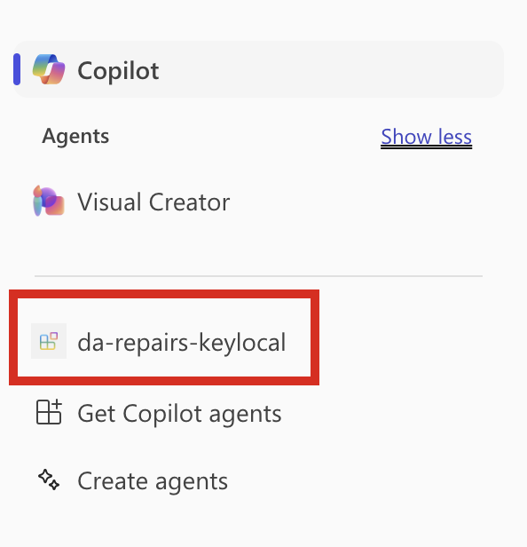
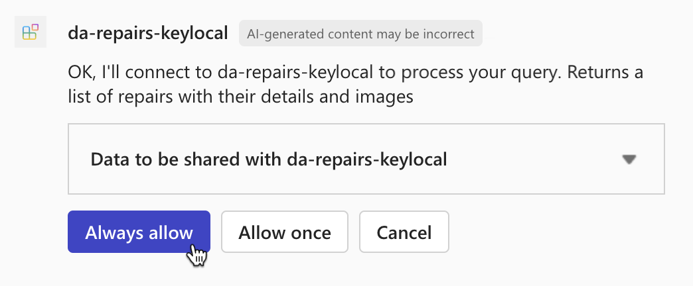
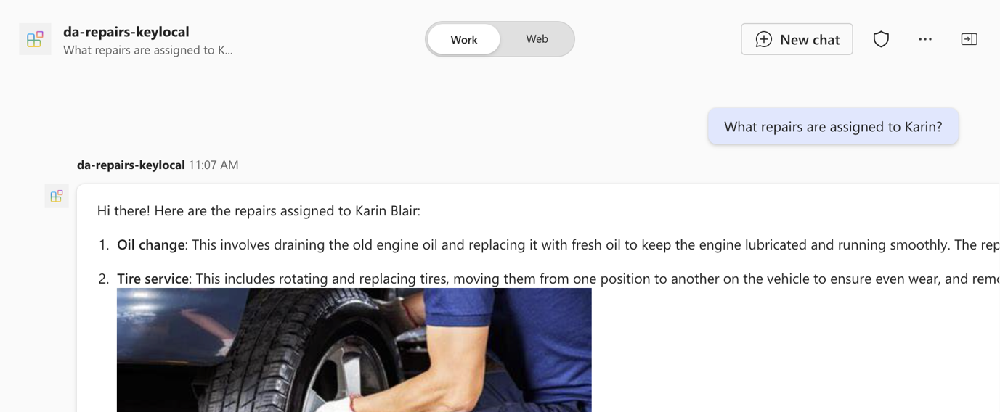

---
lab:
  title: 'Exercise 2 - Test declarative agent in Microsoft 365 Copilot Chat'
  module: 'LAB 05: Authenticate your API plugin for declarative agents with secured APIs'
---

# Exercise 2 - Test declarative agent in Microsoft 365 Copilot Chat

In this exercise, you will test and deploy your declarative agent to Microsoft 365 and test it using Microsoft 365 Copilot Chat.

### Exercise Duration

- **Estimated Time to complete**: 10 minutes

## Task 1 - Test the declarative agent with the API plugin in Microsoft 365 Copilot Chat

The final step is to test the declarative agent with the API plugin in Microsoft 365 Copilot.

In Visual Studio Code:

1. In the Activity Bar, activate the **Teams Toolkit** extension.
1. In the **Teams Toolkit** extension panel, in the **Accounts** section, be sure you're signed in to your Microsoft 365 tenant.

  

1. In the Activity Bar, switch to the Run and Debug view.
1. From the list of configurations, choose **Debug in Copilot (Edge)** and press the play button to start debugging.

  

  Visual Studio Code opens a new web browser with Microsoft 365 Copilot Chat. If prompted, sign in with your Microsoft 365 account.

In the web browser:

1. From the side panel, select the **da-repairs-keylocal** agent.

  

1. In the prompt text box, type `What repairs are assigned to Karin?` and submit the prompt.
1. Confirm that you want to send data to the API plugin using the **Always allow** button.

  

1. Wait for the agent to respond.

  

Stop the debugging session in Visual Studio Code when you're done testing.