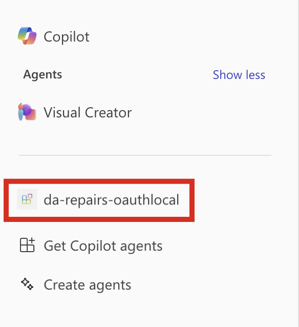
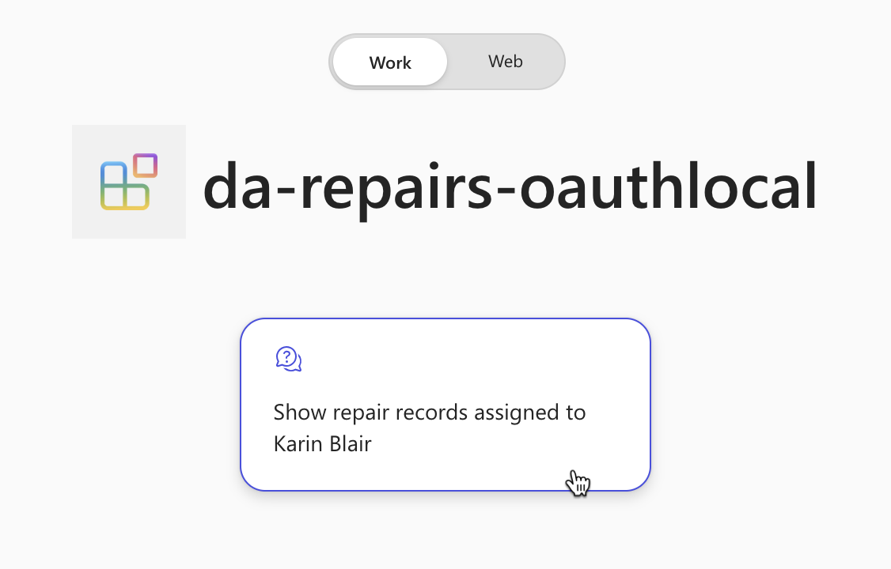
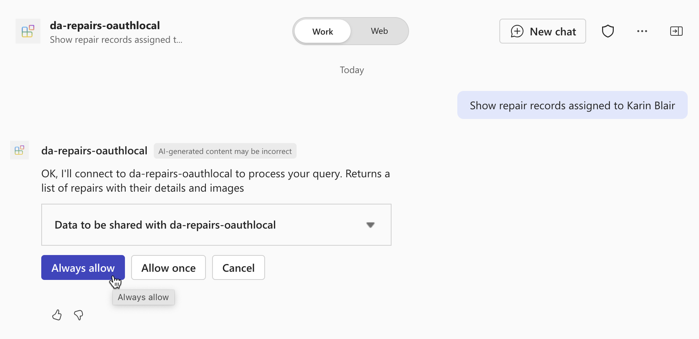
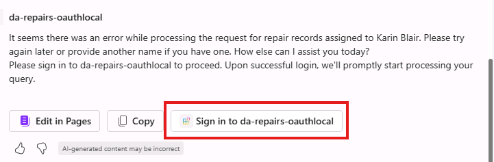
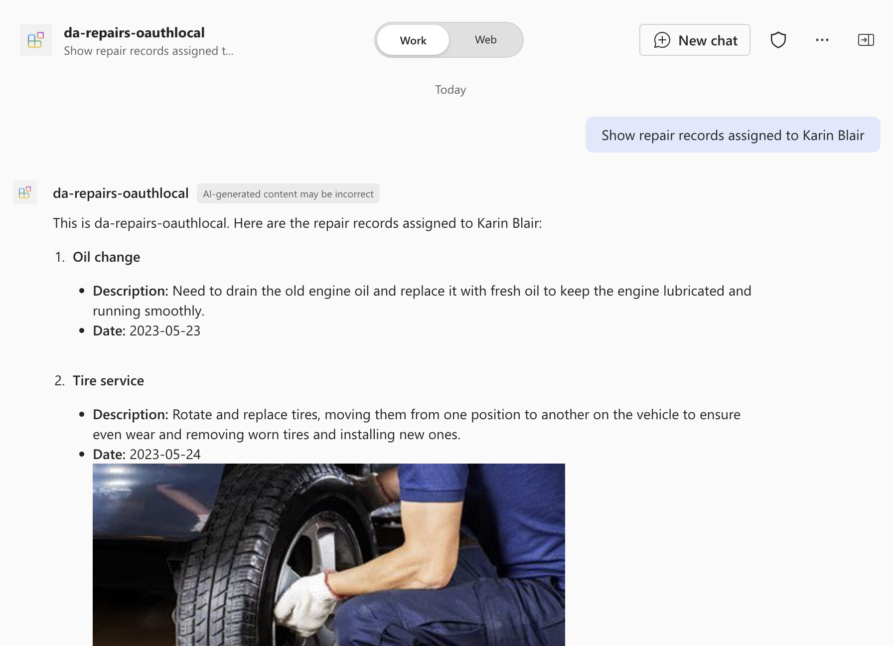
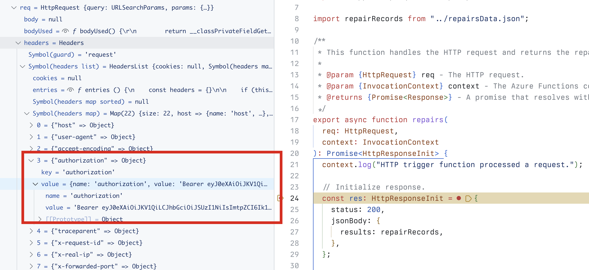

---
lab:
    title: 'Exercise 4 - Test declarative agent in Microsoft 365 Copilot Chat'
    module: 'LAB 05: Authenticate your API plugin for declarative agents with secured APIs'
---

# Exercise 34 - Test declarative agent in Microsoft 365 Copilot

In this exercise, you will test and deploy your declarative agent to Microsoft 365 and test it using Microsoft 365 Copilot Chat.

### Exercise Duration

- **Estimated Time to complete**: 5 minutes

## Task 1 - Test the declarative agent with the API plugin in Microsoft 365 Copilot

The final step is to test the declarative agent with the API plugin in Microsoft 365 Copilot.

In Visual Studio Code:

1. In the Activity Bar, activate the **Teams Toolkit** extension.
1. In the **Teams Toolkit** extension panel, in the **Accounts** section, be sure you're signed in to your Microsoft 365 tenant.

    

1. In the Activity Bar, switch to the **Run and Debug** view.
1. From the list of configurations, choose **Debug in Copilot (Edge)** and press the play button to start debugging.

    

    Visual Studio Code opens a new web browser with Microsoft 365 Copilot. If prompted, sign in with your Microsoft 365 account.

In the web browser:

1. From the side panel, select the **da-repairs-oauthlocal** agent.

    

1. In the prompt text box, type `Show repair records assigned to Karin Blair` and submit the prompt.

    > [!TIP]
    > Instead of typing the prompt, you can select it from the conversation starters.

    

1. Confirm that you want to send data to the API plugin using the **Always allow** button.

    

1. When prompted, sign in to the API to continue using the same account that you use to sign in to your Microsoft 365 tenant, by selecting **Sign in to da-repairs-oauthlocal**.

    

1. Wait for the agent to respond.

    

Even though your API is accessible anonymously because it's running on your local machine, Microsoft 365 Copilot is calling your API authenticated as specified in the API spec. You can verify that the request contains an access token, by setting a breakpoint in the **repairs** function and submitting another prompt in the declarative agent. When the code reaches your breakpoint, expand the req.headers collection and look for the authorization header which contains a JSON Web Token (JWT).

Stop the debugging session in Visual Studio Code when you're done testing.
